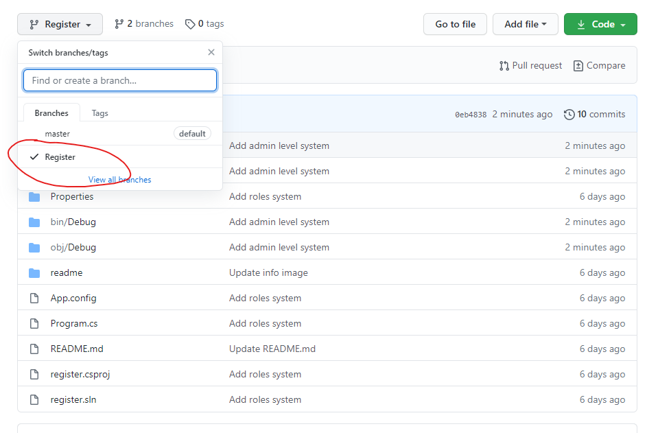
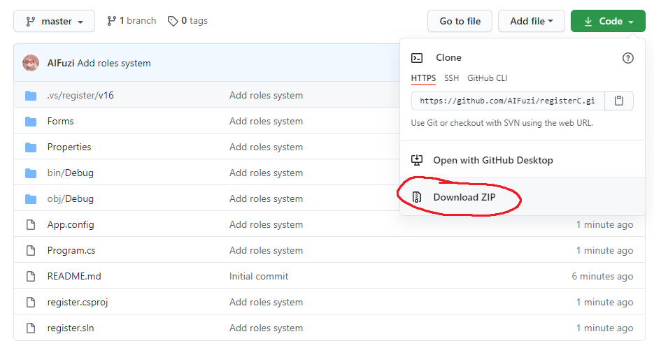

# как скачать
1. Выбери нужную ветку 

2. Скачай

# Изменить в коде
- Изменения в каждой ветке проекта свои

# При отправке преподу 
1. Удали папку "readme"
2. Удали .git, .gitignore, .gitattribute, и README.md

